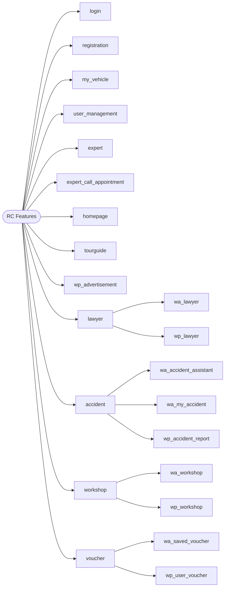

# RepairCheck (RC) — Feature Tree (SHLD1)

> Function-only view: each feature that exists on both the end-user side (Web App, `wa_`) and the admin side (Web Portal, `wp_`) branches into its two variants. Features with only one side stay as a single node.

