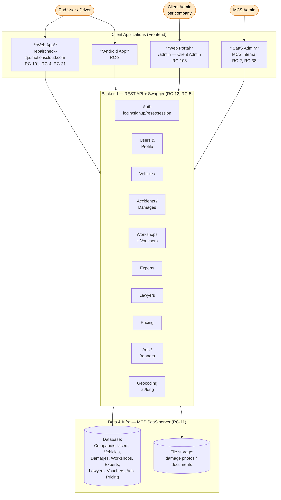

# RepairCheck (RC) — High-Level System Design

> Product: **RepairCheck** by **MotionsCloud (MCS)** — a multi-tenant SaaS for car accident / damage
> assistance (German market: *Unfallhilfe, Werkstatt, Experte*).
> Source: RC Jira epics (open) + their child stories. Last built: 2026-07-14.
>
> 🎨 **Colorful version:** [[system-high-level-design.excalidraw]] (open in Excalidraw view).

## 1. The big picture

The system has **4 client apps**, **1 shared backend API**, and **1 data/infra layer**.
Three groups of people use it:

| User | App they use | What they do |
|------|--------------|--------------|
| **End user / Driver** | Web App + Android | Report accident, find workshop/expert/lawyer, manage vehicles |
| **Client Admin** (one insurance company / tenant) | Web Portal (`/admin`) | Manage that company's users, accident reports, workshops, lawyers, ads, vouchers |
| **MCS Admin** (MotionsCloud staff) | SaaS Admin | Manage all tenants, global master data, feature flags, roles/permissions |

Multi-tenant: **MCS Admin creates Companies (tenants)**. Each Company gets its own **Web Portal**.
End users belong to a Company and use the **Web App / Android**. Everything talks to **one API**.

## 2. Architecture diagram

## 3. What each app contains (from the epics)

### A. Web App — end user (RC-101 · RC-4 · RC-21 · RC-36 · RC-39 · RC-41 · RC-46 · RC-58)
- **Account**: Registration + Register Vehicle, Login, Forgot password, Edit profile
- **Home**: Home page, Tour guide, Menu
- **My Vehicles** (RC-41)
- **Report Accident** — 3 steps + **My Accidents** (RC-46, *Unfallhilfe*)
- **Find a Workshop** (RC-36, *Werkstatt Finden*)
- **Find an Expert** (RC-58, *Experte für Fahrzeugdiagnose*)
- **Lawyer page** (RC-39)
- Sees vouchers + advertisements/banners

### B. Android App (RC-3)
- Mobile version of the Web App (same API).

### C. Web Portal — Client Admin (RC-103)
- User management (this company's users)
- Accident reports
- Manage Workshops
- Manage Lawyers
- Manage Advertisements / Banners
- Saved vouchers per user

### D. SaaS Admin — MCS Admin (RC-2 "RC Admin" + RC-38 "Sass Admin")
- **Company (tenant) management** — onboard new client companies
- **Global master data**: Workshops, Experts, Lawyers — with **import/export** + **auto geocoding**
- View **all users / vehicles / damages** across tenants
- **Feature settings** (feature flags per tenant) + **Role & permission**
- Advertisements / banners
- Soft-delete + permanent delete users; delete damage photos/documents

## 4. Backend API modules (RC-12, RC-5)
One REST API (documented in Swagger) shared by all apps:

`Auth` (login, signup, reset password, session check) · `Users/Profile` · `Vehicles` (CRUD, list per user) ·
`Accidents/Damages` (report step 1-3, statuses, list per user) · `Workshops` (+ store voucher per user) ·
`Experts` (filter by rating & distance) · `Lawyers` (filter by rating) · `Pricing` · `Advertisements` ·
`Geocoding` (lat/long for experts/workshops).

## 5. Data & infra (RC-11 "Setup")
- Runs on the shared **MotionsCloud SaaS server** (Web App + Portal deployed there).
- **Database** holds all entities (see diagram).
- **File storage** for damage photos and documents.

## 6. Core entities
`Company (tenant)` → `User` → `Vehicle`, `Accident/Damage` (with photos/docs) ·
`Workshop`, `Expert`, `Lawyer` (master data, geo-located) · `Voucher` · `Advertisement/Banner` · `Pricing`.
